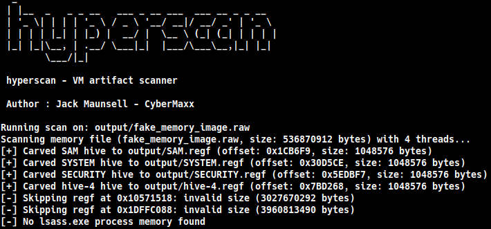

# hyperscan

**hyperscan** is a memory and disk artifact scanner built for offensive security assessments. It scans a wide range of memory and disk image formats for sensitive data like credentials, tokens, registry hives, NTLM hashes, DPAPI material, and high-entropy blobs.

---

### Features

- Scan local memory/disk images, including `.vmem`, `.vmdk`, `.vdi`, `.vhd`, `.vhdx`, `.raw`, and `.dd` files.
- Entropy-based secret detection.
- Auto-discover VM files in common Windows directories.
- Remote scanning (scan on target).

- Carves and classifies registry hives (SAM, SYSTEM, SECURITY).
- Carves LSASS process memory.
- Carves browser SQLite databases (history, cookies, etc.).
- Scans files with custom YARA rules

- Detects a wide range of secrets, including:
    - AWS Access Keys
    - JWTs
    - Passwords in plaintext
    - NTLM Hashes
    - SSH Private Keys
    - Google Cloud API Keys
    - Azure Client Secrets
    - and more...

- Logs full UNC paths for remote artifacts.
- JSON output for easy integration with other tools.

---

### Prerequisites

To enable YARA scanning, you must have the native YARA development library installed:

```bash
sudo apt-get update
sudo apt-get install libyara-dev
```

---

### Installation

```bash
go build -o hyperscan
```

---

### Usage

```bash
# Scan a local memory dump
hyperscan scan --input ./memory.vmem

# Scan a local disk image and extract artifacts to ./loot
hyperscan scan --input ./disk.vhd --out ./loot

# Scan a local memory dump and output results as JSON
hyperscan scan --input ./memory.vmem --json

# Scan with YARA rules from a directory
hyperscan scan --input ./memory.raw --yara ./rules

# Auto-scan common local VM directories
hyperscan scan --auto

# Scan a remote host
hyperscan scan --remote --host <remote-host> --username Administrator --password 'CrazyPassword14!'

# Remote SMB Share Scanning
hyperscan scan --remote --smb --host <remote-host> --share <smb-share> --share-path <path-to-scan> --username Administrator --password 'CrazyPassword14!' --file-pattern <regex-pattern>
```

---

### Options

```bash
--input, -i         Path to memory or disk image file (e.g., .vmem, .vmdk, .vdi, .vhd, .vhdx, .raw, .dd)
--out, -o           Output directory (default: ./output)
--threads, -t       Number of threads for parallel scanning (default: 1)
--auto              Automatically scan local common VM file locations
--json              Enable JSON output

--remote            Enable remote scanning
--host              Remote host IP or name
--username          Remote login username
--password          Remote login password
```

---
### Simple Demo




---

### Author
Jack Maunsell - Colorado State University

---

### TODO
- Live system memory scanning via agents
- Plugin support for custom extractors
