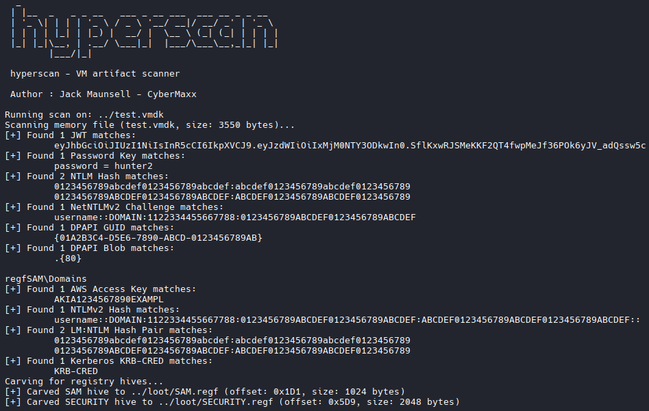

# hyperscan

**hyperscan** is a memory and disk artifact scanner built for offensive security assessments. It scans `.vmem` and `.vmdk` files for sensitive data like credentials, tokens, registry hives, NTLM hashes, DPAPI material, and high-entropy blobs.

---

### Features

- Scan local `.vmem` or `.vmdk` memory/disk images
- Entropy-based secret detection
- Auto-discover VM files in common Windows directories
- Remote scanning (scan on target)

- Carves and classifies registry hives (SAM, SYSTEM, SECURITY)
- Carves LSASS process memory

- Logs full UNC paths for remote artifacts
- JSON output for easy integration with other tools

---

### Installation

```bash
go build -o hyperscan
```

---

### Usage

```bash
# Scan a local memory dump
hyperscan scan --input ./memory.vmem

# Scan a local disk image and extract artifacts to ./loot
hyperscan scan --input ./disk.vmdk --out ./loot

# Scan a local memory dump and output results as JSON
hyperscan scan --input ./memory.vmem --json

# Auto-scan common local VM directories
hyperscan scan --auto

# Scan a remote host
hyperscan scan --remote --host 192.168.1.100 --username Administrator --password 'CrazyPassword14!'
```

---

### Options

```bash
--input, -i         Path to VMEM or VMDK file
--out, -o           Output directory (default: ./output)
--auto              Automatically scan local common VM file locations
--json              Enable JSON output

--remote            Enable remote scanning
--host              Remote host IP or name
--username          Remote login username
--password          Remote login password
```

---
### Simple Demo



---

### Author
Jack Maunsell - Colorado State University

---

### TODO
- Live system memory scanning via agents
- Plugin support for custom extractors
